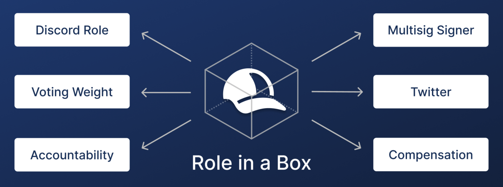

# 👋 Welcome to Hats Protocol

## Introduction

**Hats Protocol is the backbone for decentralized work.** Hats empowers groups to get things done by delegating responsibilities to the right contributors, giving them the hard and soft authorities they need to do their work, and installing real-time accountability mechanisms to ensure people follow through.

You can be decentralized AND get things done. This is the power of Hats Protocol.

## What Are Hats?

Hats are programmable, revocable, and legible roles, which can be collectively controlled by the wearer of the "Top Hat", which could be an individual or a group, such as a DAO. Hat-based roles can be flexibly imbued with responsibilities, authorities, accountabilities, context, and more.

Hats are represented onchain by tokens that conform to the ERC-1155 standard. They are connected together in a tree structure (aka a "Hats tree") to create flexible operational and governance structures that are controlled by an organization or its designees, which can then be visualized in any Hats front-end.

Hats tokens can be held by any address including an EOA, multisig, or contract. When an address has a balance of 1 of a given Hats token, it is considered a "wearer" of that "hat". Then, by way of various token-gates, that address is granted the [authorities](using-hats/connecting-hats-w-permissions-and-authorities/) that have been associated with that hat.

Each hat can have any number of wearers up to the hat’s max supply. Hats are granted and revoked by the organization, or agents/smart contracts that are designated by the org. Wearers can renounce a hat, but they cannot transfer it.

<figure><figcaption>
<a href="https://app.hatsprotocol.xyz/trees/1/22">The RareDAO Hats tree</a> includes roles across the Rare Foundation as well as the RareDAO Council, Ops Team, and Grants Committee
</figcaption></figure>

_**Case Study:** By bringing its roles onchain with Hats, RareDAO provides contributors with the context and powers needed to make decisions and take actions, while keeping them accountable to the organization as a whole. “Power is now associated with a role, not a specific address or individual,” says Brennan Mulligan, DAO Program Manager at SuperRare. “This derisks the system as a whole by allowing us to hotswap people in and out of roles without changing the underlying power structures.”_ [_See the full case study here._](https://www.hatsprotocol.xyz/wearer/raredao-case-study)

## Why Should We Use Hats?

Using Hats, groups can create and manage roles that unlock the power of decentralized work.

Decentralized work could be amazing. But collective governance is hard. Today, decentralized organizations like DAOs and networks are making tradeoffs between decentralization and effectiveness. What they’re missing is a familiar piece of organizational infrastructure: roles.&#x20;

Decentralized organizations need a better way of delegating and revoking roles, responsibilities, and authorities to get things done. You no longer have to choose decentralization or effectiveness: you _can_ get things done while simultaneously embodying the values of decentralization and autonomy.&#x20;

#### Groups that use Hats will:

* Delegate authorities to individuals or teams while retaining ultimate control by the collective
* Experience less pain and administrative costs associated with managing contributors and transferring authorities from one person or team to another
* Effectively hold contributors accountable to their commitments
* Clearly understand what’s _actually_ happening across the group at any point in time, including where any gaps exist

#### Contributors who wear Hats will:

* Feel clear about the roles and responsibilities they are accountable for
* Instantly have all the authorities they need to do their work (e.g., discord role, wiki admin rights, multisig signer, twitter access, etc.)
* Know who to go to for important information or decisions
* Understand which roles are not yet fulfilled that they could be eligible for

<figure><figcaption></figcaption></figure>

## Developer Documentation

The next few pages are devoted to documentation for Hats usage and Hats Tree setup by Hat Wearers, such as DAO governance facilitators, operations managers, and summoners.&#x20;

In these pages, we emphasize the usage of the first front-end built by Haberdasher Labs for this purpose, but recognize that there will be many apps that are able to interact with Hats Protocol in our open-source ecosystem.

If you're a developer looking for more technical documentation, including contract functions, SDK details, subgraph information, and integration help, please jump directly to the "For Developers" section of these docs:


[Broken link](broken-reference)

