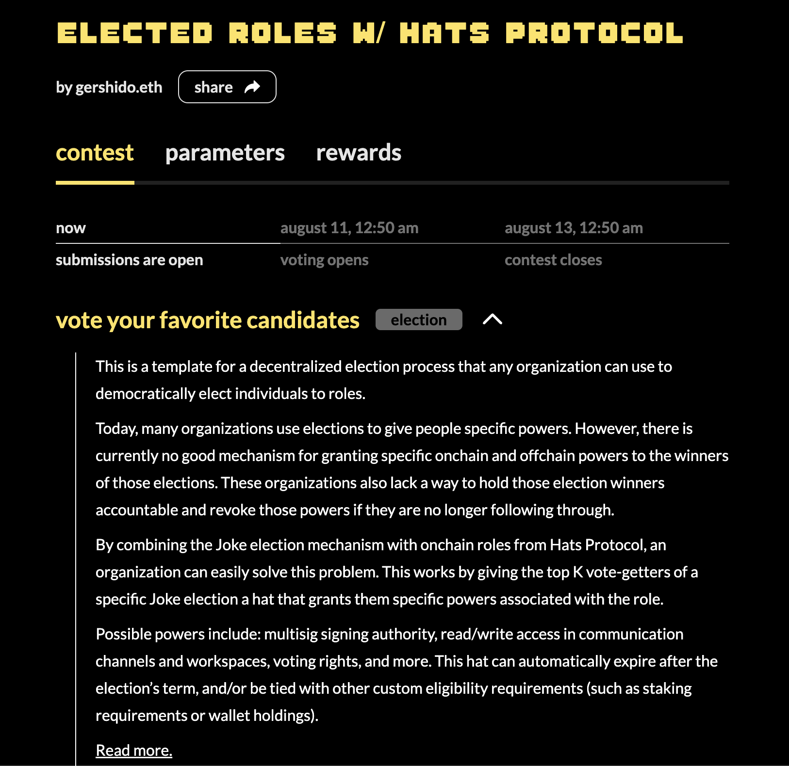

# JokeRace Eligibility

## **Overview**

[JokeRace](https://jokerace.xyz/) enables communities to make, execute, and reward decisions onchain. By using this module, communities can elect the wearers of a hat through a JokeRace election. More specifically, the eligible wearers are creators of the top voted proposals in the election.

The number of winners of an election, and thus the number of possible wearers made eligible through this integration, is configurable. Additionally, a term period can be set, after which the winners will no longer be eligible to wear the hat.

The module's code is open source and is available [here](https://github.com/Hats-Protocol/jokerace-eligibility).

## Example

Using this module enables the wearers of the "Elected Role" hat to be the winners of a chosen JokeRace election:

<figure><figcaption>
<a href="https://app.hatsprotocol.xyz/trees/5/54">https://app.hatsprotocol.xyz/trees/5/54</a>
</figcaption></figure>

Any JokeRace election can be used for any hat, even elections that were held in the past or ones scheduled in the future. Following is the election for the "Elected Role" hat:

<figure><figcaption>
<a href="https://jokerace.xyz/contest/goerli/0xd00F6a711522a84C73aED9997Fcf207B41E97311">https://jokerace.xyz/contest/goerli/0xd00F6a711522a84C73aED9997Fcf207B41E97311</a>
</figcaption></figure>

The top 5 most voted candidates in the election are the ones eligible for the role, for a term period of 1 year, as defined in the module.

## **Using the JokeRace Eligibility Integration**&#x20;

_Contact us at support \[at] hatsprotocol \[dot] xyz if you want to explore this module. You can also check out the open source repository_ [_here_](https://github.com/Hats-Protocol/jokerace-eligibility)_._
