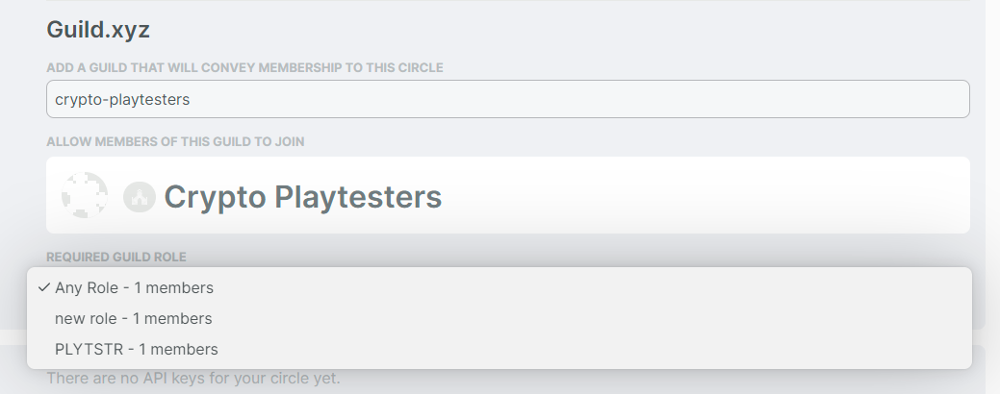

# Coordinape

To hat-gate access for a Coordinape circle, you will need to complete the following steps:

1. **Create a** [**Guild**](discord/guild.xyz-greater-than-discord.md) **role** associated with Coordinape circle access (or use an existing Guild role; note that only one Guild role can be used to provide access to the Coordinape circle)
2. **Create a** [**Coordinape**](https://app.coordinape.com) **circle** (or use an existing coordinape circle)
3. Select the **Admin** settings of that Coordinape circle
4. Under Integrations, **enter the URL of your Guild.xyz guild** and **select the appropriate Guild role\***
5. Select **Save Settings**
6. Under **Members** select **Add Members,** and then select **Guild.xyz.** Copy the link provided: **this is the invite link you should use** to provide hat-gated access into your Coordinape circle.

<figure><figcaption>
Found in your Coordinape circle Admin settings under Integrations
</figcaption></figure>

For additional details, see the [Coordinape guide](https://docs.coordinape.com/info/integrations/guild) for token-gating access with Guild.
