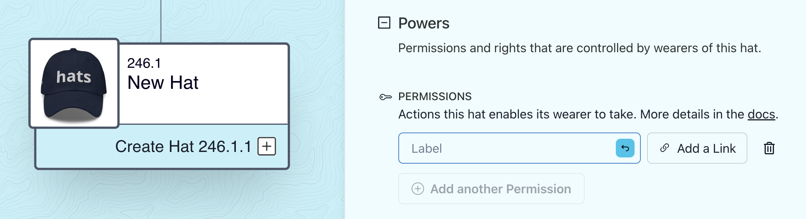

# Documenting Hat Powers & Responsibilities

As you [connect explicit authorities to hats](connecting-authorities-to-hats/), you can document those powers onchain. This includes both hard powers like authorities provided by token gates, as well as soft powers provided through social agreements.

Additionally, you can document the responsibilities attached to these powers, providing the relevant context to the hat wearers and the organization as a whole.

### Adding Responsibilities

* Select "Edit Tree"
* Locate and select the hat
* Open the "Responsibilities" section

<figure><figcaption></figcaption></figure>

* Add any amount of responsibilities, each as a short free text paired with an optional link.

### Adding Powers

* Select "Edit Tree"
* Locate and select the hat
* Open the "Powers" section

<figure><figcaption></figcaption></figure>

* Add any amount of powers, each as a short free text paired with an optional link.
