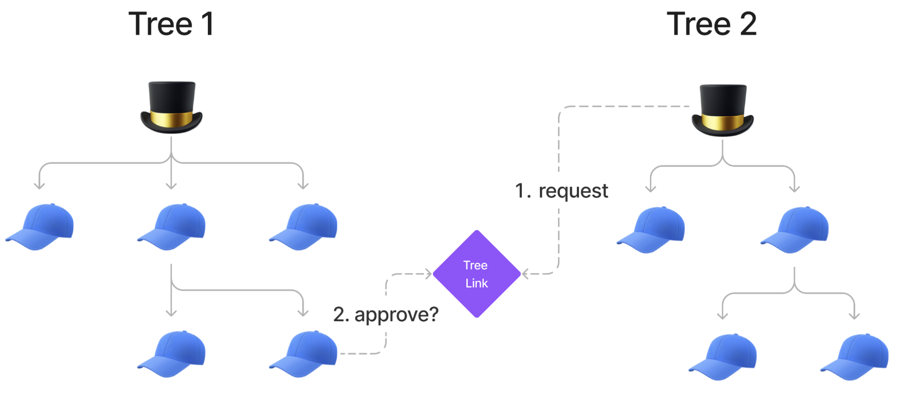
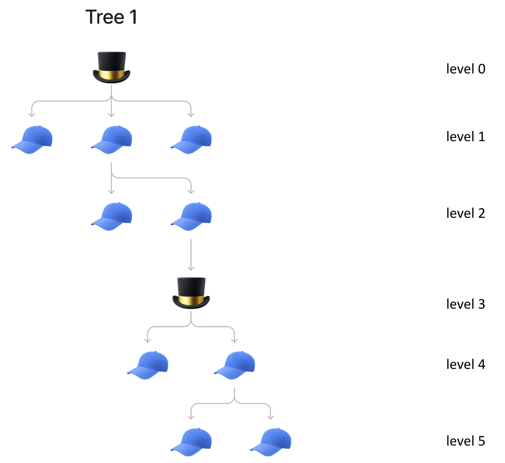

# 🔗 Linking Trees Together

This powerful feature lets you graft two separate Hats trees together, by linking the Top Hat from one tree to a hat from another tree. Hats trees that have been linked can then be unlinked later.

**Example use cases for linking Hats trees include:**

* Onchain organizational mergers (e.g. one DAO joining another DAO)
* Enabling experimentation with Hats within subgroups before scaling to the whole organization (e.g. enable a subgroup to build out its own Hats tree and try out new Hats features with different authorities and responsibilities before merging into organization's main tree)
* "Refactor" your organization (e.g. fork your Hats tree to try different Hats configurations before merging with the main tree)

## Overview

At a high-level the process of tree linking looks like this:&#x20;

Initially, two separate Hats trees exist, each with their own respective Top Hats, as seen in the diagram below.

<figure><figcaption></figcaption></figure>

Hats Tree 2 requests to link to a specific hat in Hats Tree 1. Effectively the Top Hat from Tree 2 asks a specific hat from Tree 1, _"hat, ser - will you be my admin hat?"_

<figure><figcaption></figcaption></figure>

If approved, Tree 2 links, or "grafts", to Tree 1. The approving hat becomes the admin of the Top Hat from Tree 2.&#x20;

The Top Hat from Tree 2, along with its associated branch, can be unlinked from Tree 1 at any point in the future, thereby returning back to the initial state of having two separate Hats trees.

<figure><figcaption></figcaption></figure>

When a link between these two trees is created, as seen in the diagram above, the level 2 hat from Tree 1 becomes the admin for the Top Hat of tree 2, and therefore the Top Hat of Tree 2 effectively becomes a level 3 hat in Tree 1. The previous Top Hat from the now nonexistent Tree 2 will then hold the same properties as as any other hat in Tree 1, with one distinction: the Top Hat and its child hats can be unlinked from Tree 1 at any point in the future, thereby returning back to the initial state of having two separate Hats trees.

## Digging Deeper

For more technical details on tree linking, see the [Linking Hats Trees](../for-developers/hats-protocol-overview/linking-hats-trees.md) page within the "For Developers" section of these docs.

## How to Link Trees Together

_Coming soon. Contact us at support \[at] hatsprotocol \[dot] xyz if you're looking to link two trees together and need some guidance._
